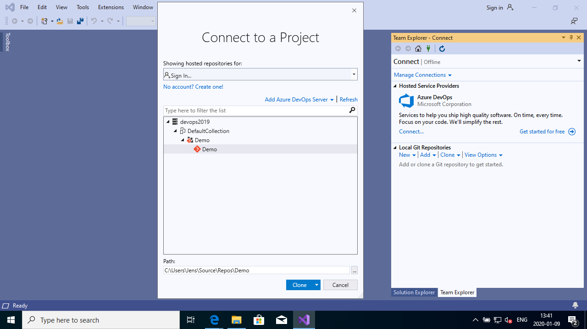
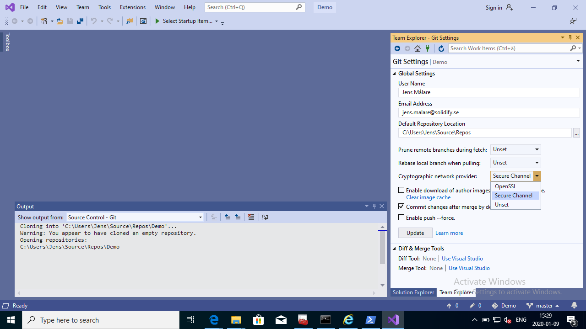
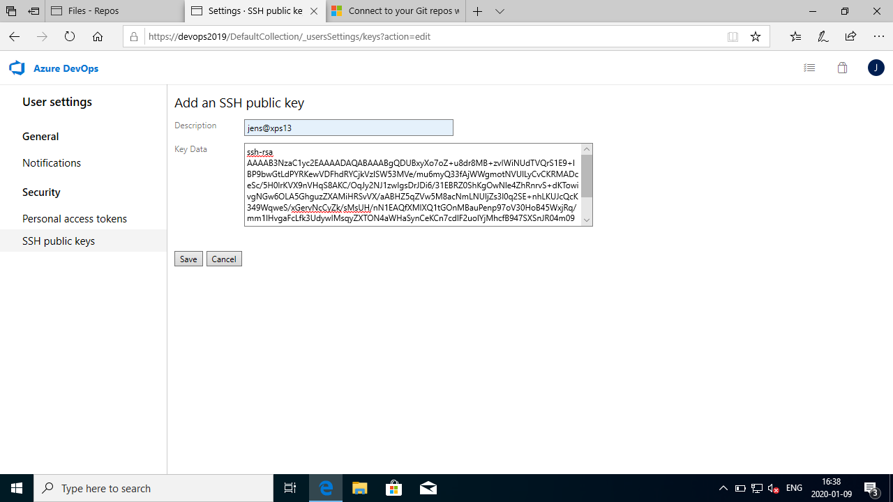
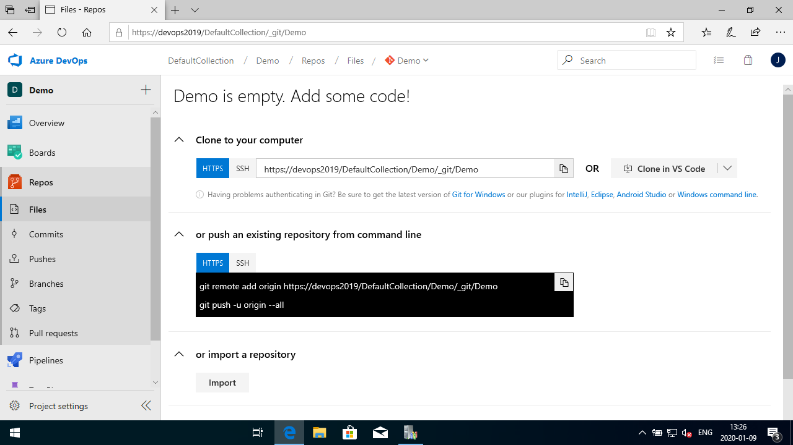
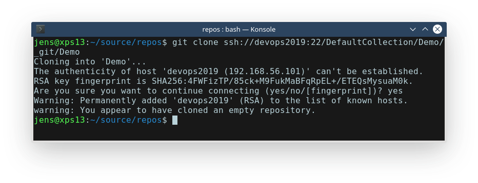

# Git Administration
Create and connect to a Git Repository.

## Prerequisites
You will need one or more of the following software installed, depending on which method you are going to use to connect to the team project and repository.
* Visual Studio
* Git for Windows

## Exercise: Connect using Visual Studio
This exercise applies only if you have Visual Studio installed. If not, try one of the subsequent exercises instead.

### Goal
You will connect to the team project using Visual Studio Team Explorer and make a local clone of a repository.

### Tasks
1. Open the *Team Explorer* pane and click *Manage Connections...*. Add an Azure DevOps Server connection and enter the server URL. When the authorization process is completed you should be able to select a project, repository and clone it.


1. If the clone operation fails due to the server presenting a self-signed certificate which Git does not accept, you can change the *Cryptographic network provider* settings to *Secure Channel*. This means Git will use the Windows Certificate Stores when validating a server certificate.


## Exercise: Set up SSH credentials

### Goal
You will prepare a SSH key pair to authenticate with a Git repository and attempt a clone.

### Tasks
1. If you don't already have a SSH key pair that you wish to use you must create one with the ```ssh-keygen``` command. If you accept the defaults (just press enter at all prompts, a passphrase is not strictly necessary) you should find the files id_rsa and id_rsa.pub in a folder .ssh in your home directory.


1. Add the contents of the public key file (the one with the pub extension) to you Azure DevOps user profile security settings.


1. Find the repository URL in the web interface and use the SSH format (not HTTPS) to clone it to your computer.



1. If your server is using self-signed certificates it is expected that the clone operation will fail. The next exercise will present solutions to this.

## Exercise: Resolve SSL Issues

If the server you're connecting to is using a self-signed certificate you need to install the same certificate on the client computer for the SSL connection to validate.

### Goal
After performing the following tasks you will be able to clone the repository without problems.

### Tasks
1. Export the server root CA certificate in base-64 encoded form.

2. Install the certificate on your client computer.

3. Git for Windows (in version 2.14) supports the  use of Windows Certificate Stores as a source of certificates for SSL validation. This can be enabled during installation of Git for Windows. If this option was not chosen, it can be enabled afterwards: ```git config --global --replace-all http.sslBackend schannel```

