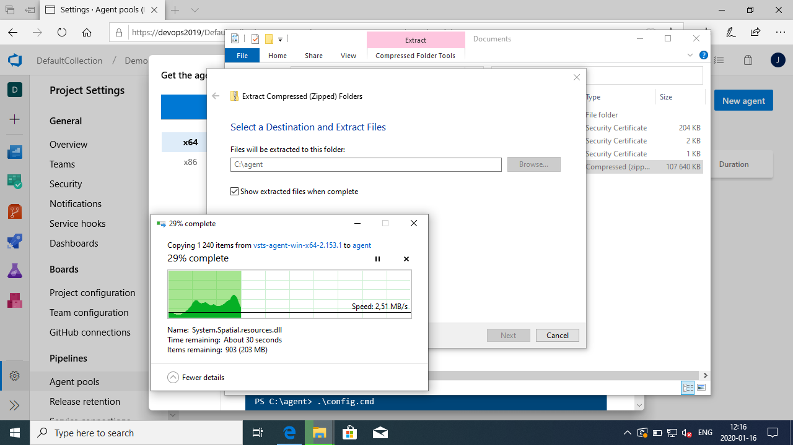

# Azure Pipelines Setup and Administration
In this set of exercises you will add a local build service account, install and configure a new build agent and create a build pipeline to verify the setup. Then you will add an agent as part of a deployment pool and create a release definition that use this pool to deploy to target hosts.

## Prerequisites
(none?)

## Exercise: Install a Build Agent
(NOTE: Installing on the Application Tier C: drive, in production instead use a dedicated build server with a separate storage partition for agents.)

### Tasks

1. Browse to Project Settings > Agent Pools and click New Agent. The dialog has a download button and basic instructions for configuring the agent. Download the agent zip-file.


1. Locate the agent zip-file and extract it to a folder at the root of the C: drive, preferably called ```C:\agent1```. A numbered suffix is useful in case you add more agents later.


3. Open an *Administrative Command Prompt* and create a local user account "devopsbuild" for the build service by typing the command ```net user devopsbuild * /add```.


1. Configure the build agent using the script config.cmd. Make sure to use the ```--gituseschannel``` parameter so that the Git installation bundled with the agent is getting the server certificates from the local Windows Certificate Stores. Answer yes to running the agent as a service and provide the service user name ("devopsbuild") you created in the previous step.


2. The agent will register and start as a windows service.


3. Add the build service account to the Build Service Accounts security group.


1. View the agent status from by browsing to Project Settings > Agent Pools > Default > Agents.


## Exercise: Create a Build Pipeline

1. Browse to Pipelines > Builds and create a new pipeline.


1. Select Azure Repos Git as the source location.


1. Select the (only) repository in your project. 


1. Select to create a starter pipeline.


1. A sample YAML pipeline definition is shown. Add the following code to the end of the example definition, then *Save and run* to queue it as a new build to the build agent pool.
    ```
    - task: PublishBuildArtifacts@1
    inputs:
        PathtoPublish: '$(Build.SourcesDirectory)/README.md'
        ArtifactName: 'drop'
        publishLocation: 'Container'
    ```
    

1. You can follow the build sequence and log output in real time as it progresses.


1. When the pipeline has finished you can review the result.


1. You added a step at the end of the example definition. The purpose was to produce an output artifact (in our case the README.md file) as the result of the build. You can browse the published artifacts using the Artifacts button.


## Exercise: Create a Deployment Pool

1. Browse to Organization Settings > Deployment Pools and create a new deployment pool.


1. Give the pool a name that reflects the purpose or domain of the target hosts. A common practice with traditional deployment stages is to represent the environments that your application should pass on its way to production. You would create separate deployment pools for dev, test and prod environments.


1. Instructions are shown for how to place a deployment agent on the target host and register it with the pool you just created. In this exercise we do not have a separate host but will instead use the Azure DevOps application tier as a deployment target.


1. Open a PowerShell command prompt with administrative permissions and create a separate user account that will run the deployment agent by typing the command ```net user devopsdeploy * /add```, then add the account to the administrators group by typing ```net localgroup administrators devopsdeploy /add```.


1. Copy and paste the given registration script on the target host in the same PowerShell command prompt. When asked for the user account, enter devopsdeploy and the password you chose in the previous step.


1. The deployment agent has registered with the server and joined the dev pool. It is ready to accept deployment jobs from a release pipeline.


## Exercise: Create and run a release pipeline

1. Browse to *Pipelines > Releases* and create a new pipeline.


1. Select the option at the very top to start with an *Empty Job*.


1. Give the first stage a name that reflects the deployment environment, in our case 'dev' is suitable.


1. Click *Add an artifact* and select your build pipeline.


1. Click the "*1 job, 0 task*" link for the dev stage, or navigate to the same using the *Tasks* drop-down submenu, to open the stage configuration. Replace the agent job with a deployment group job and select the deployment pool you created in the previous exercise.


1. Add a task to the deployment group job. Search for 'copy files' and add it to the job.


1. Configure the task accordingly:


1. Save the release pipeline definition and create a new release from this definition by clicking *Release > Create release*.


1. Monitor the progress of the deployment.


1. Access the logs from each deployment task.


